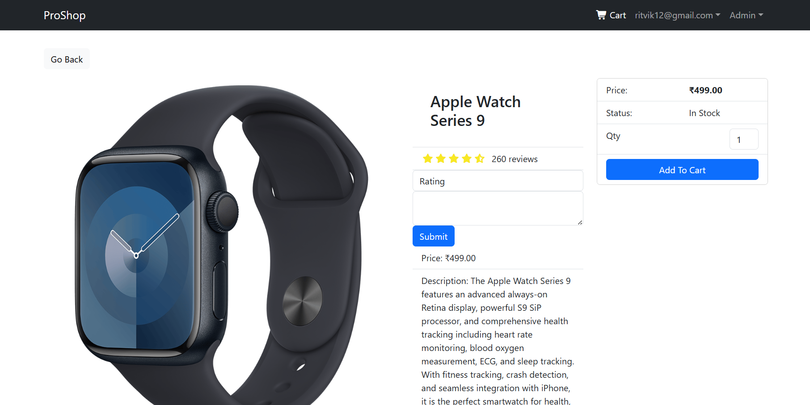
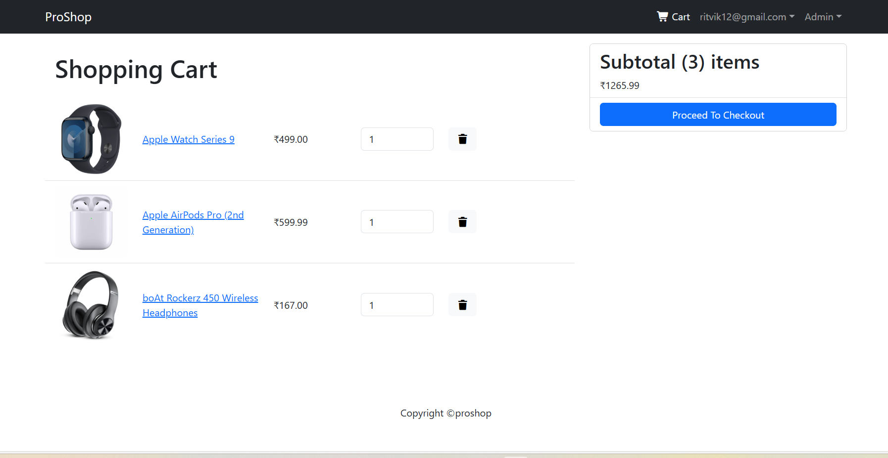
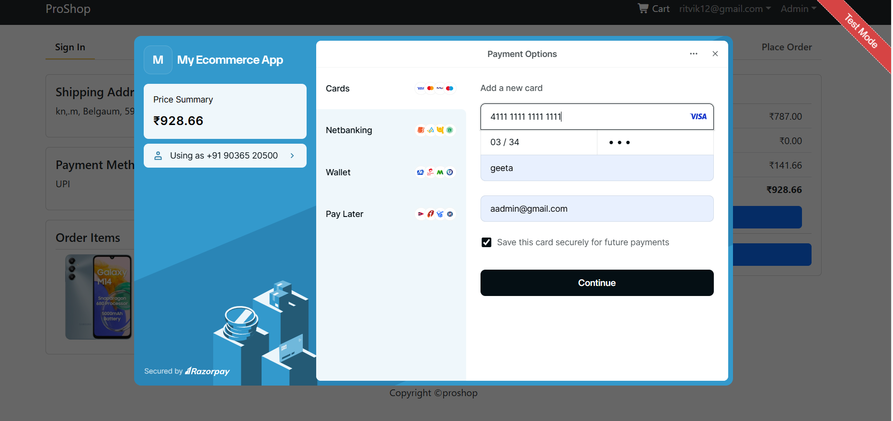
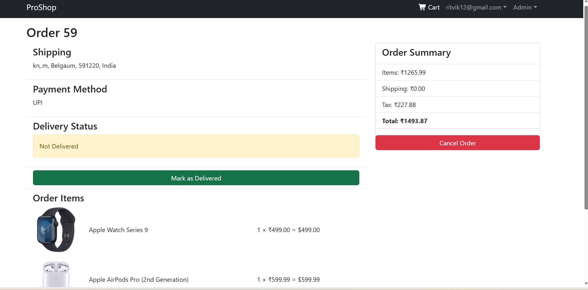
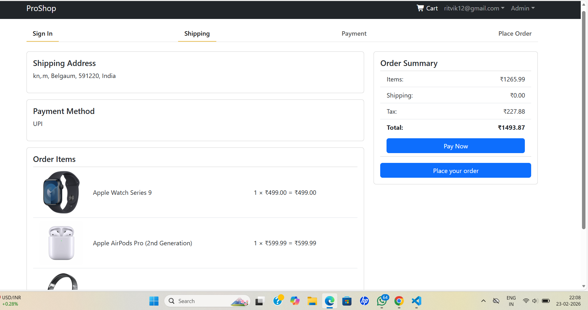
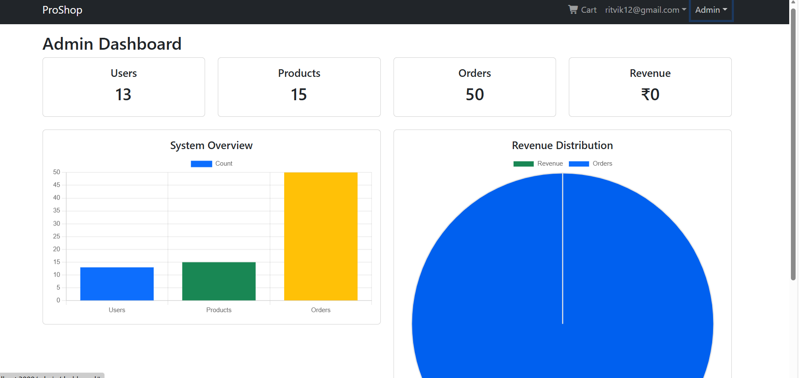

# 🛒 Full Stack E-commerce Web Application

A production-ready full stack E-commerce platform built using Django REST Framework and React.js. The application supports authentication, verified product reviews, Razorpay payment integration (test mode), admin controls, and secure order management.

---

## 🚀 Project Overview

This project demonstrates a scalable e-commerce architecture with secure backend APIs, JWT authentication, purchase-based reviews, payment gateway integration, and role-based admin controls.

It simulates a real-world online shopping platform similar to Amazon or Flipkart.

---

## 🛠 Tech Stack

### Frontend
- React.js
- Redux
- React Router
- Bootstrap

### Backend
- Django
- Django REST Framework
- JWT Authentication

### Database
- SQLite (Development)

### Payment Integration
- Razorpay (Test Mode)

---

## ✨ Features

### 👤 Authentication
- User registration & login
- JWT-based authentication
- Role-based access control (Admin/User)

### 🛍 Product Management
- Product listing
- Product detail page
- Rating & reviews
- Verified buyer reviews

### 📝 Review System
- One review per user
- Purchase-based review validation
- Admin moderation
- Helpful votes
- Abuse reporting

### 🛒 Cart & Orders
- Add to cart
- Quantity management
- Shipping details
- Order summary
- Order history

### 💳 Payment Integration
- Cash on Delivery
- Razorpay (Test Mode)
- Dynamic order creation
- Secure payment handling

### 👨‍💼 Admin Panel
- Manage users
- Manage products
- Manage orders
- Moderate reviews

---

## 🏗 Architecture Overview

Frontend (React) communicates with Django REST APIs.

Flow:

User → React UI → Axios → Django API → Database  
Payment → Razorpay → Backend verification → Order update

---

## 🔄 API Flow Example

### Create Order
POST /api/orders/add/

### Create Razorpay Order
POST /api/payment/razorpay/create/

### Submit Review
POST /api/products/{id}/reviews/

### Get User Orders
GET /api/orders/myorders/

---

## 📸 Screenshots

### 🏠 Home Page

### 📦 Product Page

### 🛒 Cart Page

### 💳 Razorpay Payment

### 📄 Order Page

### 🧾 Place Order Page

### 🛠 Admin Dashboard

## ⚙ How to Run Locally

### Backend Setup

1. Navigate to backend folder:cd backend

2. Create virtual environment:python -m venv venv

3. Activate environment:venv\Scripts\activate

4. Install dependencies:pip install -r requirements.txt

5. Create `.env` file and add:RAZORPAY_KEY_ID=your_key
RAZORPAY_KEY_SECRET=your_secret

6. Run migrations: python manage.py migrate

7. Start server: python manage.py runserver

---

### Frontend Setup

1. Navigate to frontend folder:cd frontend

2. Install dependencies:npm install

3. Start frontend:npm start

## 🔐 Environment Variables

The following environment variables are required:

- RAZORPAY_KEY_ID
- RAZORPAY_KEY_SECRET
- SECRET_KEY
- DEBUG

## 🚀 Future Improvements

- Product recommendation system
- Stripe integration
- Deployment on AWS / Render
- Performance optimization
- Docker containerization